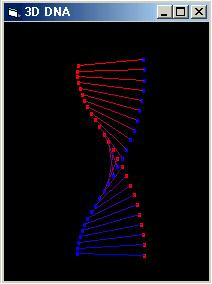



## A 3D Rotating DNA Strand

### Description

Draws a rotating strand of "DNA", in real 3D! If you like it, please vote!
 
### More Info
 

             |
---                |---
**Submitted On**   |2000-12-31 11:06:42
**By**             |[Simon Lynn](https://github.com/Planet-Source-Code/PSCIndex/blob/master/ByAuthor/simon-lynn.md)
**Level**          |Intermediate
**User Rating**    |4.9 (191 globes from 39 users)
**Compatibility**  |VB 6\.0
**Category**       |[Graphics](https://github.com/Planet-Source-Code/PSCIndex/blob/master/ByCategory/graphics__1-46.md)
**World**          |[Visual Basic](https://github.com/Planet-Source-Code/PSCIndex/blob/master/ByWorld/visual-basic.md)
**Archive File**   |[CODE\_UPLOAD1320112312000\.zip](https://github.com/Planet-Source-Code/simon-lynn-a-3d-rotating-dna-strand__1-13973/archive/master.zip)

